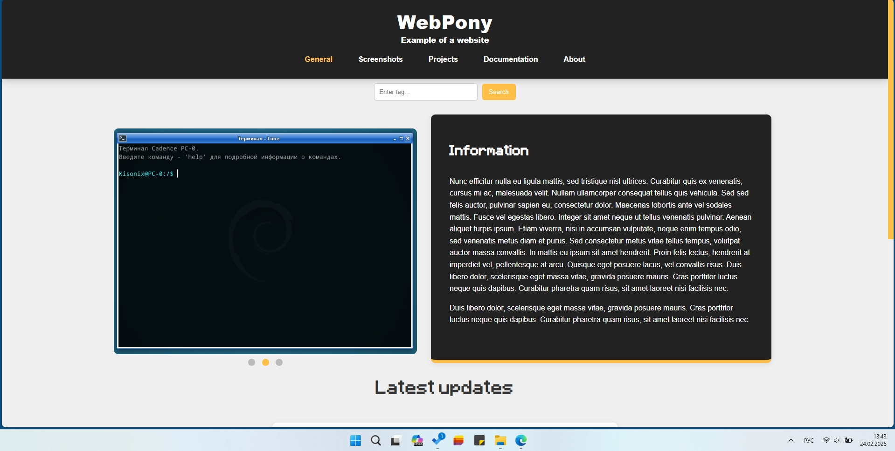
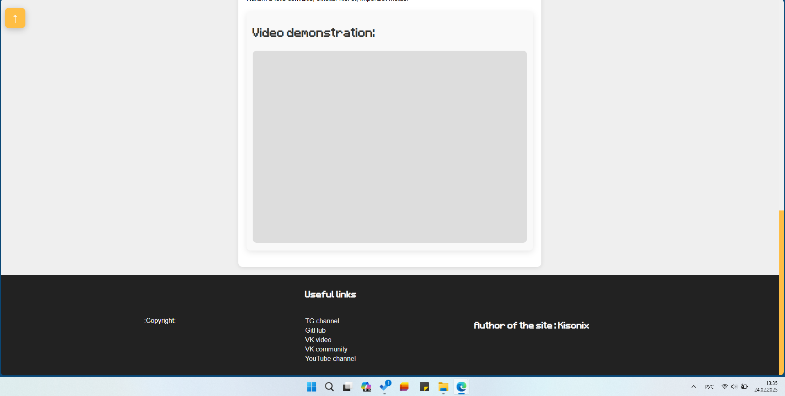
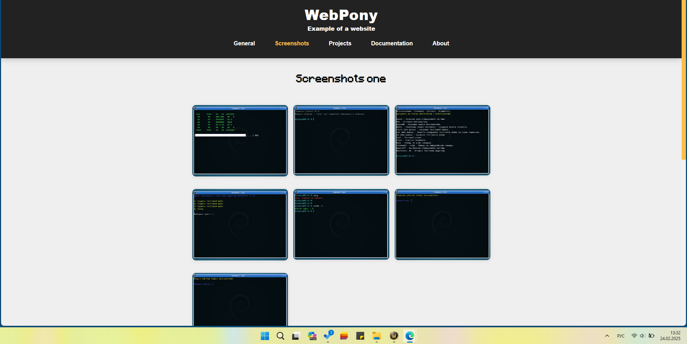
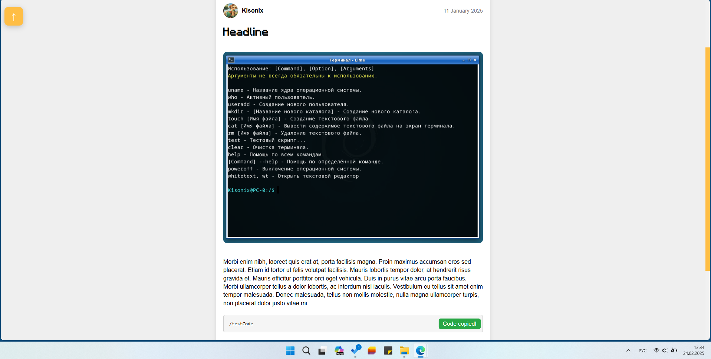
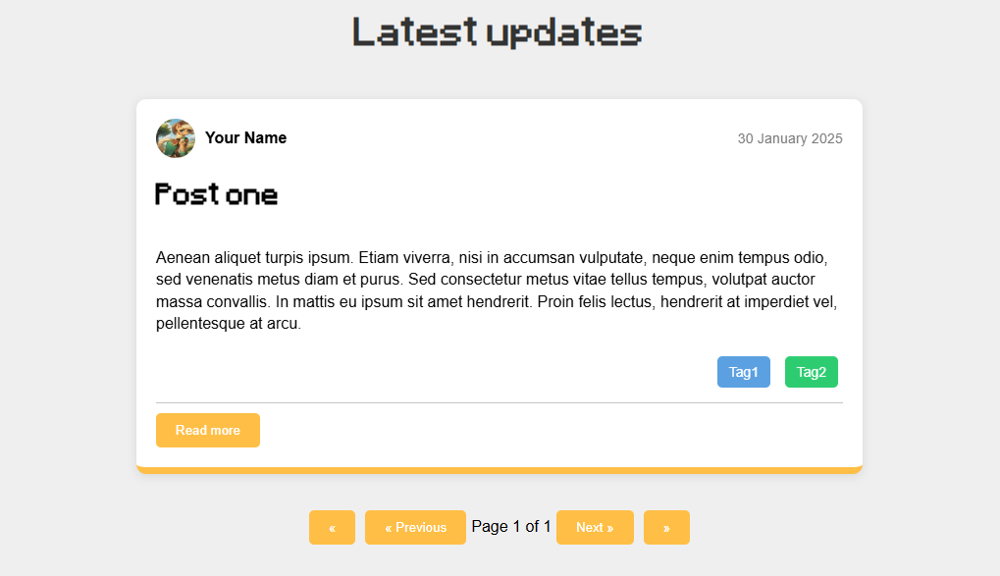
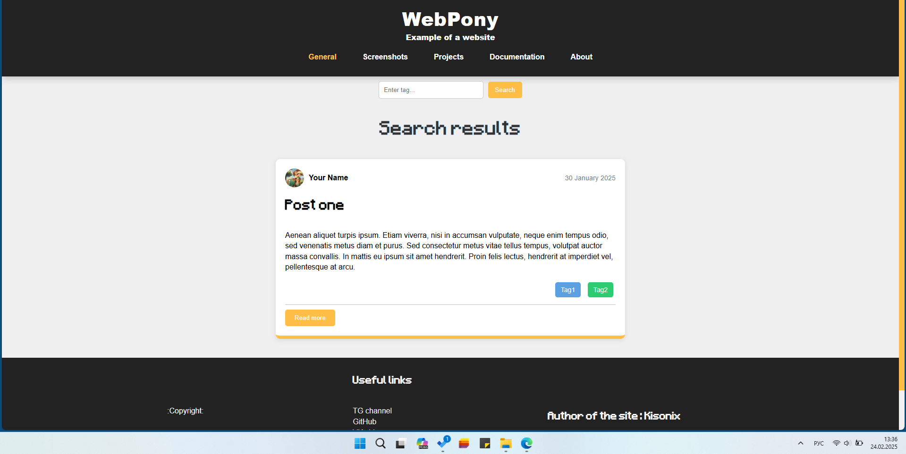
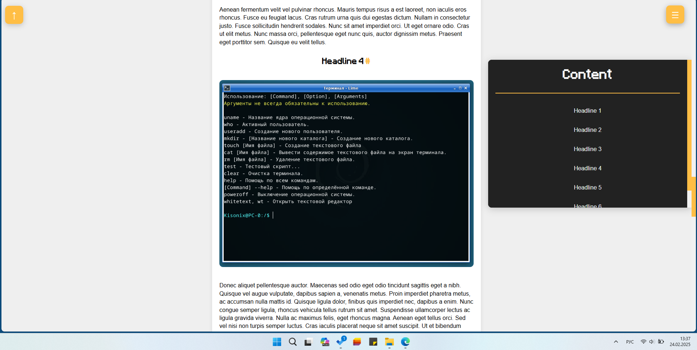
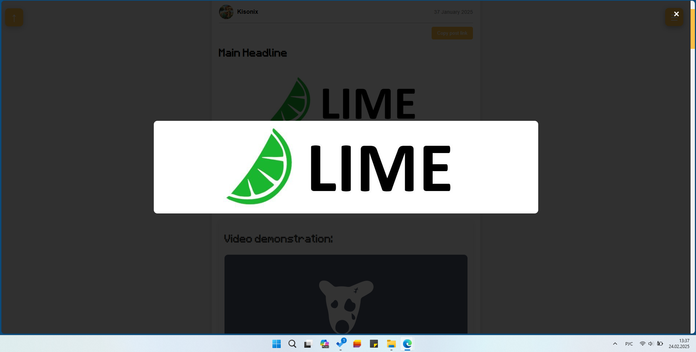

# WebPony

Website design.

HTML, CSS, JS.

Can be used for news, blog, projects and more.

## Demonstration of the website

## Implemented systems

1 - Image carousel on the main page.

2 - Information block.

3 - Search by tags.

4 - Latest updates, post banners.

5 - Page numbering and transitions.

6 - Header with buttons.

7 - Footer with links.

8 - Page scroll button up.

9 - Section with screenshots with image enlargement.

10 - Audio and video inserts.

11 - Drop-down list for the section: Documentation.

12 - Beautiful and smooth animations.

13 - Sliding block with content.

14 - Page finishing.

15 - Post link copy button.

16 - Code copy button.

17 - Colored scrolling.

